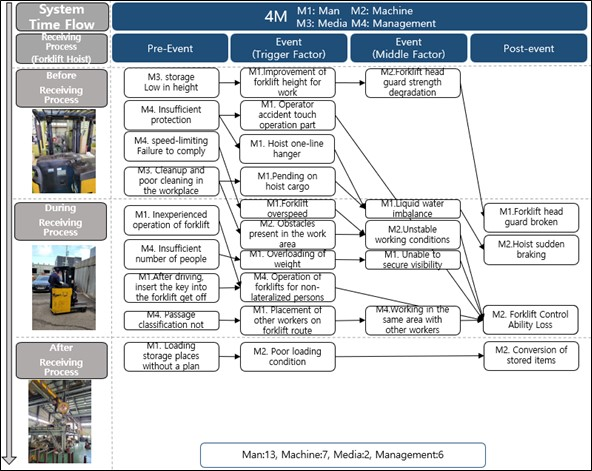
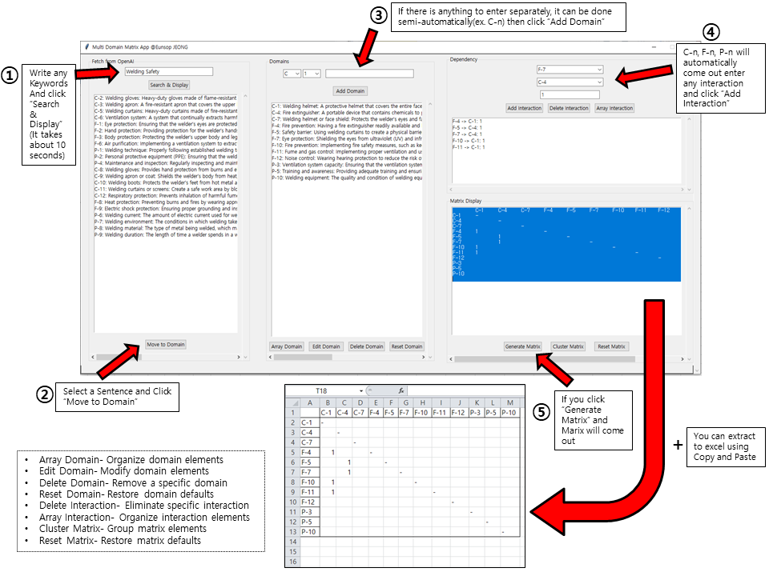

# Research Goal

Identifying specific hazardous risk factors can yield an overwhelming number of dangers.

It's the duty of us, safety engineers, to simplify these factors, making it feasible for everyone to practice safety efficiently.

# Safety-Management
This is a system to be made for safety management. I will keep updating in the future.

